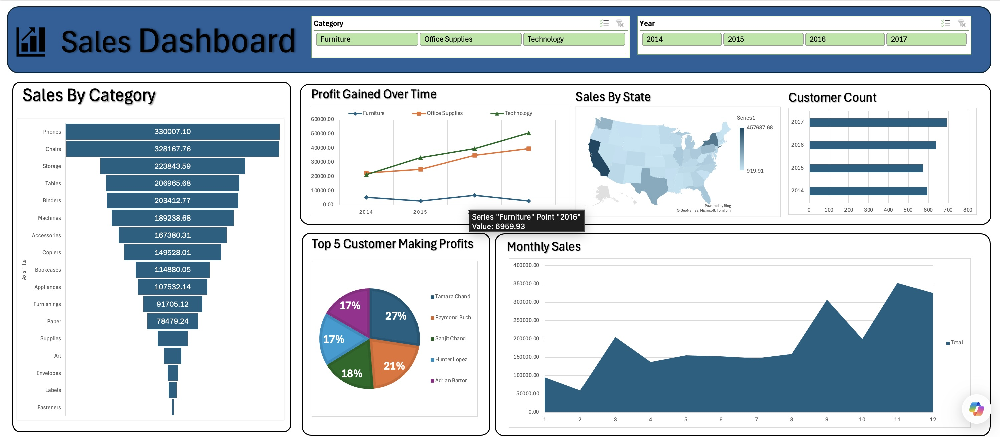

# Sales Dashboard Analysis Project

## Project Overview

**Project Title**: Sales Dashboard Analysis  
**Tool Used**: Microsoft Excel  
**Project Type**: Sales Data Analysis & Interactive Dashboard

This project focuses on analyzing sales performance data and building an interactive dashboard using Microsoft Excel. The dashboard provides insights into category-wise sales, profit trends, customer distribution, monthly sales performance, and state-wise sales analysis.

The objective of this project is to transform raw business data into meaningful visual insights that support better business decision-making.

---

# Dashboard Preview

---

# Objectives

1. Analyze overall sales performance across different categories.
2. Track profit trends over multiple years.
3. Identify top-performing product categories.
4. Analyze customer growth over time.
5. Identify top customers generating profits.
6. Visualize sales distribution across different states.
7. Build an interactive dashboard using Excel slicers and charts.

---

# Tools & Features Used

- Microsoft Excel
- Pivot Tables
- Pivot Charts
- Slicers
- Maps Visualization
- Data Cleaning
- Interactive Dashboard Design
- Data Aggregation & Analysis

---

# Dashboard Components

## Sales By Category

This section analyzes sales performance across different product categories such as:

- Phones
- Chairs
- Storage
- Tables
- Binders
- Machines
- Accessories
- Copiers

### Key Insight

- Phones generated the highest sales overall.
- Furniture and technology categories performed strongly compared to office supplies.

---

## Profit Gained Over Time

This section tracks yearly profit trends for:

- Furniture
- Office Supplies
- Technology

### Key Insight

- Technology category showed the highest profit growth over time.
- Furniture profits remained comparatively lower.

---

## Sales By State

This section visualizes sales performance geographically across states using a map chart.

### Key Insight

- California generated the highest sales among all states.
- Sales concentration was stronger in major commercial regions.

---

## Customer Count

This section tracks customer count growth across years.

### Key Insight

- Customer count increased steadily from 2014 to 2017.
- 2017 recorded the highest customer count.

---

## Top 5 Customer Making Profits

This section identifies customers contributing the highest profits.

### Top Customers Included

- Tamara Chand
- Raymond Buch
- Sanjit Chand
- Hunter Lopez
- Adrian Barton

### Key Insight

- The top customers contributed a significant share of total profits.

---

## Monthly Sales

This section analyzes monthly sales trends throughout the year.

### Key Insight

- Sales peaked towards the end of the year.
- November recorded the highest sales performance.
- Early months showed comparatively lower sales.

---

# Interactive Features

The dashboard includes slicers for:

- Category
- Year

These slicers allow dynamic filtering and interactive analysis of dashboard visuals.

---

# Key Business Findings

- Technology products generated the highest profit growth.
- Phones were the top-selling category.
- Customer growth improved consistently over the years.
- California contributed the highest sales.
- Year-end months generated stronger sales performance.
- A small group of customers contributed significantly to profits.

---

# Conclusion

This project helped strengthen my understanding of:

- Excel dashboard development
- Data visualization
- Pivot tables and pivot charts
- Interactive reporting
- Sales trend analysis
- Business intelligence concepts

Excel dashboards are basically controlled chaos held together by pivot tables and optimism.

---

# Files Included

- `Sales Analysis Report.xlsx`
- `Dashboard.jpeg`
- `README.md`